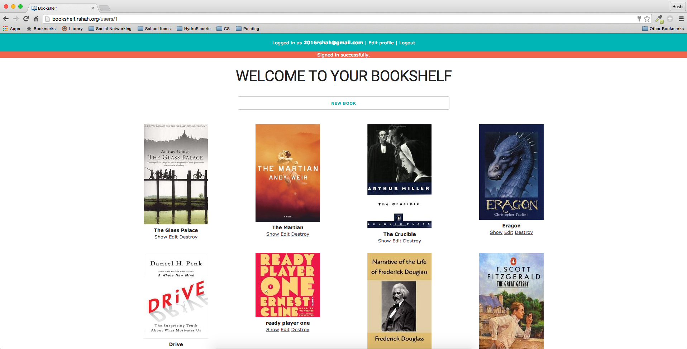

#[Bookshelf](http://bookshelf.rshah.io/)

Showcase the books you have read with this handy bookshelf. 

Make your own account and try it out: http://bookshelf.rshah.io/users/sign_up

Check out an example of a bookshelf: http://bookshelf.rshah.io/users/1

#Keep track of your books

Just type in the title and author and we'll take care of the rest. We'll search for the ISBN number and use that to find a pretty picture of the cover of the book (for others to judge it by). 

(This won't really work with dummy text, make sure you try a real book!)

#Show off how well read you are

That's why everybody reads, right? Just share your profile page for others to see your bookshelf. 

Check out my bookshelf [here](http://bookshelf.rshah.io/users/1). 

#Common Problems

It is possible that we don't find a cover at all for your book. If so, try manually entering a different ISBN number or just give up. 

It is also possible that we find a cover to a slightly different (but hopefully related) book. Again, try manually fixing the ISBN. Sorry!

#Contributing

Think this project is awesome? Contribute to it! Think it is really awful? Contribute to it anyways to make it less awful! Either way, please contribute! If you see anything you want to help out with open up an issue. If you think your fix is simple enough not to warrant an issue just send in a pull request. As usual, follow good coding practice: please keep code neat, make sure it works, etc.

Also, a super easy way to contribute without doing anything is starring this project on Github, I would really appreciate it!

#Todo
 - Add share buttons (twitter, facebook) for each profile
 - Make it pretty (please help me on this one, I'm really not a designer!)
 - About page with info about the project (about same info as README)
 - ~~Footer with link to github repo~~
 - Usernames rather than emails